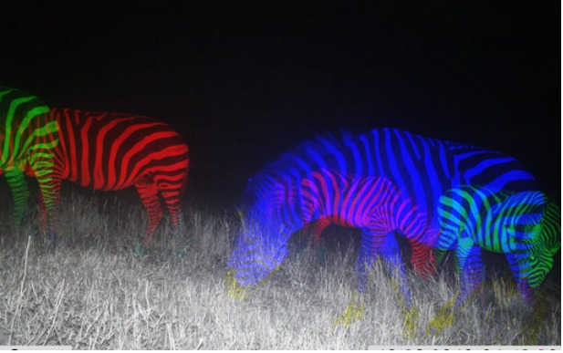
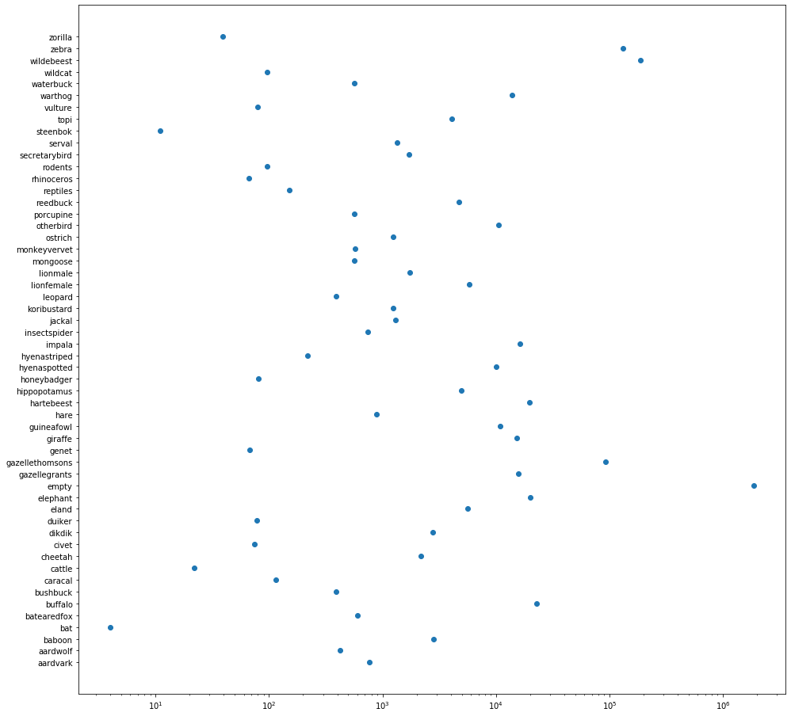
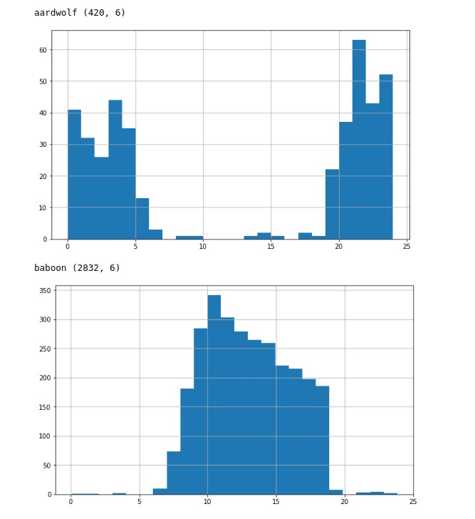

# Hakuna Ma-data - means no worries

Identifying presense and species of animals from camera trap images across Africa - 1st / 811 teams



*If you see something like this just say Hakuna Ma-data - it means no worries*


## Introduction

This post describes how we built a system that can identify presence and species of animals from sequences of camera trap images. The system achieved 1st place among 811 teams on DrivenData's [Hakuna Ma-data: Identify Wildlife on the Serengeti with AI for Earth](https://www.drivendata.org/competitions/59/camera-trap-serengeti/page/145/).

Given the size of the training set (6.7M images and ~6TB) both training and inference of our system can be characterized as lightweight. The whole training takes 2 weeks on one GPU 1080Ti and inference takes 1/3 of the available inference time.

Here are the steps needed to reproduce our experiments that contributed to the winning solution:

1. Clone the repository and install dependencies (one package - fastai).
    ```bash
    wget .......
    !pip install fastai==1.0.57
    ```

1. Process train_metadata and train_labels so we can just easily use it with fastai. Note that the output of this line is already provided in "data" directory so you can skip it and move to the next line.
    ```bash
    python3 create_train_metadata_with_labels.py
    ```
1. Train all models at once.
    ```bash
    bash train.sh
    ```
1. Or one model at the time.
    ```bash
    python3 train_hakuna_random_srx50.py
    ```
1. Or if you wanna use our trained weight you can directly predict on test images.
    ```bash
    python3 predict.py
    ```
### Directory structure
```
├── README.md          <- The top-level README for developers using this project.
├── data               <- Add training and testing set here
├── assets             <- Trained models, model architectures, utility scripts
│   └── models         <- Trained models, model architectures
├── notebooks          <- Jupyter notebooks.
├── figures            <- Figures.
├── config             <- Path to data -default = "data".
├── requirements.txt   <- The requirements file for reproducing the analysis environment, e.g.
├── predict.py         <- Predict on test images using provided weights or your own weights
├── train_all.sh       <- Training script for all the models from final ensemble.
├── train_hakuna_...py <- Training scripts for individual models

```

## The challenge

Read more at the challenge website.

: Identify Wildlife on the Serengeti with AI for Earth](figures/serengeti-home.jpg)

*An example image from Hakuna Ma-data: Identify Wildlife on the Serengeti with AI for Earth*


## Data pre-processing

No preprocessing was done. We used resized images from kaggle provided by Pavel Pleskov


## Building a prediction model

### 0. Multilabel classification

Multilabel classification is the process of assigning one or more class labels to each input. Therefore, the last layer has N number of sigmoid outputs.

### 1. Input

Initial experiments are done using input size 256x192 but the actual training was performed using larger images (512x384). It is likely that increasing the input size would bring additional benefits. However, we would not be able to finish training before the deadline and therefore we continued with 512x384.

**Train on the whole dataset without validation**. We did only some small experiments using small input size on a subset of one season and validated on subsets from several other seasons (mini_vals). We concluded that improvement on train set is correlated with mini_vals, including season 10. We decided to train on the full train set without validation.

### 2. Data augmentation

The relatively large dataset is available in the competition with a large portion of empty images (75%) that visually appear similar. However, there is likely no two identical images. Due to the circular nature of the data (both time and date), and variying wheather conditions (clouds, shades, wind) there are many subtle differences hardly visible by naked eye. This together with horizontal flip was enough to avoid overfitting as we only trained for 1 epoch.

These are the image augmentation techniques used in our solution:

* horizontal flips (p=0.5)


### 3. Architectures

In total, we trained 4 models ([2x SE-ResNext50](https://arxiv.org/abs/1709.01507), [EfficientNets B1 and B3](https://arxiv.org/abs/1905.11946) ). We utilized weights pre-trained on [ImageNet](www.image-net.org). The only change we made to these achitectures is the last output layer set to the number of classes (54). For efficientnets we kept default [Dropout](http://jmlr.org/papers/v15/srivastava14a.html) of 0.2 and 0.3 for B1 and B3 respectively and for SeResNext50 we set it to 0.0.

### 4. Loss function and metrics

We optimized **Cross Entropy** loss which was correlated with the official evaluation metric **mean aggregated binary log loss**. In our initial experiments we inspected top1 and topK accuracy to better understand the scale and type of difficulties in this challenge.

### 5. Imbalance

The training set is largely imbalanced with 3/4 of images being empty with no animal present on them. Presense of different species in the training set was also hugely imbalanced toward wildebeest, zebra and gazellethomson. We found that these 4 classes are contributing the most to the log loss. All the remaining classes were present in <1%.

We decided not to treat imbalance in any particular way. This assumption was based on our hopes that hidden test set (season 11) will have similar class distribution as in other seasons.




### 6. Training

One of the biggest advantages that the fastai library offers is a flexible training loop along with great out of the box support for controlling training parameters through techniques such as the [one cycle training policy](https://arxiv.org/pdf/1803.09820.pdf). Besides, you can easily utilize most of the pretrained models.

We trained our models for 1 epoch using the fit_one_cycle function. We finetunned all the layers with equal learning rate using [Adam](https://arxiv.org/abs/1412.6980) optimizer. We set the max_lr to be LR=1e-4, with warm start for ~500 iterations (epoch x 0.0002) and then with cosine annealying reduced to to LR/100

The models were trained for 1 epoch only using two different sampling strategies. In one strategy we used random sampling from all seasons and in the other we processed data in chunks (subsets) composed of one or more seasons. The seasons 9 and 10 were purposly used at the end of the training to allow the model to get a better understaning of the recent changes in the vegetation.

```
| Architecture    | Training sampling| Epochs | BS | Accu |
|-----------------|------------------|--------|-----------|
| SE-ResNext50    | random           |   1    | 16 |  2   |
| SE-ResNext50    | season by season |   1    | 13 |  3   |
| EfficientNet B1 | season by season |   1    | 16 |  2   |
| EfficientNet B3 | random           |   1    | 11 |  3   |
```

### Inference

Weighted ensemble of 4 models with total of 6 forward passes per image. For SE-ResNext50 trained season_by_season two checkpoints are used (season 9 and season 10). For other SE-ResNext both flipped and not flipped images are used. With such lightweight achitectures the inference uses only 1/3 of the available execution time (2:50 / 8h)


### Postprocessing

Mean was used for classes representing species and gmean for empty class.

## What did not work?



*Postprocessing with time priors was not helpful as CNN learned it already*

1. **Heavy augmentation** - it simply takes longer to converge and with such a massive dataset we could not afford it. Besides we found evidence that heavy augmentation such as rotation, warping, zooming or cropping have negative effect because of the noise we introduce with images where animal is present only on the edges of images.
2. **Adjusting probabilities based on priors** such as day-time / season. For instance, some species are active during the night and others not or have different seasonal behaviours. However, including these priors was not always helpful so we decided to drop it. Convnets learned easily day-night priors.
3. **Background Subtraction for “animal like” region proposals**
4. **meta-learner** - Neural network on top of CNN probabilities and cyclic DateTime features
5. **Further fine-tuning on recent seasons** - The two models trained with random sampling were further fine-tunned on seasons 9+10 but it showed signs of overfitting (better loss on seasons 9-10 than earlier season). Since we already had two models in our ensemble that were trained with the same logic (to use the recent data at the end of training) we decided to drop it.
